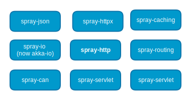

## What spray is

* DSL for HTTP
* TCP abstraction for Actors
* HTTP-Server/-Client

<!-- click -->

## For the random EE-dude

Spray is

* servlet (spec/container) + httpClient + JaxRS
* but _fast_, _async non-blocking_
* ... on actors

<!-- click -->

## What spray is _not_

* MVC framework
* Component Framework

<!-- click -->

### spray modules



<!-- click -->

### spray-io

* message- and actor-based abstraction over java.nio
* already part of akka (akka-io since 2.2.0)
* domain: payload (ByteStrings) and connection-events

<!-- click -->

### spray-io

<!-- click -->

### spray-can

* Provides akka-io extension for HTTP
* Abstracts raw ByteString events to

<!-- click -->


### spray-http

* immutable DSL over the HTTP protocol
* (parboiled: PEG parser)

<!-- click -->

###
    case class HttpMessage()
    case class HttpRequest()
    case class HttpResponse()
    case class HttpHeader()

<!-- click -->

### spray-httpx

* tools for HTTP-handling
* (de)compression
* encoding
* content-negotination

<!-- click -->

### spray-json

* `implicit` based json-serialization
* uses jackson

<!-- click -->

### spray-routing

* Routes
* Directives

<!-- click -->

### Directives are shapeless

```scala
package spray

import shapeless._

package object routing {

  type Route = RequestContext ⇒ Unit
  type RouteGenerator[T] = T ⇒ Route
  type Directive0 = Directive[HNil]
  type Directive1[T] = Directive[T :: HNil]
  type PathMatcher0 = PathMatcher[HNil]
  type PathMatcher1[T] = PathMatcher[T :: HNil]

}
```


