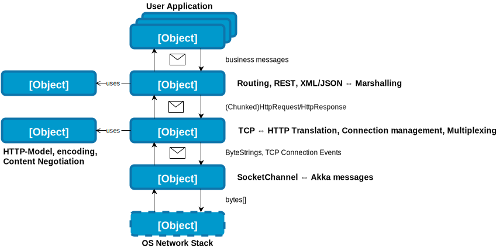
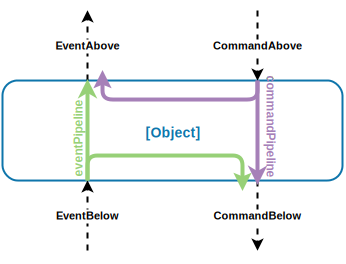
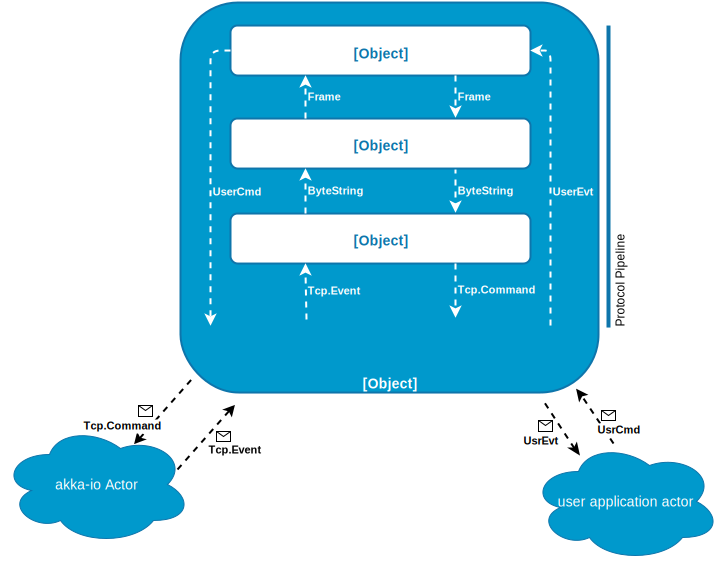

### spray is

* HTTP/REST API
* network abstraction for actors
* HTTP server/client

Notes:
hi

<!-- click -->
### For the Java-EE-dude

Spray is

* a servlet-(spec/container) + HTTPClient + JAX-RS
* but _async_, _non-blocking_, _fast_
* ... on <!-- .element: class="transparent" style="display:inline; margin-bottom: -1em" --> _actors_

<!-- click -->
### What spray is __not__

* HTML aware
* MVC framework
* UI-Component Framework
* _better try play/lift_

<!-- click -->
### spray is open source

[github.com/spray/spray](https://github.com/spray/spray)

* First public release in April 2011 (0.5.0)
* Initiated by Mathias Doenitz


[from ohloh.net/p/sprayio](https://www.ohloh.net/p/sprayio) <!-- .element: style="font-size: .5em" -->


<!-- click -->
### Actor model

<!-- .element: class="transparent" style="display:block; margin:0 auto" -->
[from Erlang: The Movie](https://www.youtube.com/watch?v=qyVvGjNjBOA) <!-- .element: style="font-size: .5em" -->

Notes:

* Do you know actors? May we skip?
* Model is a bit older, first publications in 1973

<!-- click -->
### Actor model

* Component model for concurrent applications
* _scalable_, _responsive_
* We are talking about:
    * Actors sending messages to other actors mailboxes
    * Other actors _react_ and may send further messages
* Purest form of object-orientation?

Notes:

* PPL Claim (CITE!): Pure form of OOP (Objects sending messages) with real control flow
* Its not like passing your own execution-control to a called object


<!-- click -->
### Actors ...

* _react_ to messages
* can only do one thing at time (logical single-threaded)
* can have a __local__ state
* are alive (have a lifecycle) <!-- .element: class="fragment" -->
    * can be spawned at runtime
    * can die due to failures
    * can be revived by their supervising parents

<!-- click -->
### Actors ...

* decoupled
    * No direct references between actors
    * Using an actor _address_ to communicate with an actor
* cheap <!-- .element: class="fragment" -->
    * Your JVM can host thousands++ of them
* location transparent <!-- .element: class="fragment" -->
    * Actors may reside on the same jvm or on another host
    * mMssages can be passed over the network

<!-- click -->
### Akka

* Is an implementation of the actor model
* Provides a runtime for actors
    * thread management
    * mailboxes & ordered message delivery
    * scheduling
    * (remoting)

<!-- click -->
### spray modules

<!-- .element: class="transparent" style="width: 100%; height:100%" -->


<!-- click -->
### a spray HTTP-Server
<!-- .element: class="transparent" style="width: 100%; height:100%" -->

Notes:

* imagine ByteString as immutable byte[]-array
* addition: spray-can does ssl too
* addition: spray-http does parsing & rendering

<!-- click -->
### akka-io

* formerly known as spray-io (akka-io since 2.2.0)
* message and actor based abstraction over Java NIO asynchronous channels
* stream-like channel data ⇔ actor friendly events

<!-- click -->
### akka-io

* Acts in server and client role
    * incoming data = Event
    * outgoing data = Command
* domain: payload (ByteStrings) and connection-events
* can be used for any type of protocol
* supports TCP and UDP

Notes:
* Wraps nio Socket channels and selectors.
* Passes 'events' TBD
* Database driver reference!

<!-- click -->
### akka-io TCP model

```scala
package akka.io
object Tcp {
    sealed trait Message

    trait Command extends Message
    case class Connect(remoteAddress, localAddress, options, timeout)
        extends Command
    case class Bind(handler: ActorRef, localAddress, backlog, options)
        extends Command
    case class Write(data: ByteString, ack: Event) extends Command
    case object Close extends Command

    trait Event extends Message
    case class Connected(remoteAddress, localAddress) extends Event
    case class Received(data: ByteString) extends Event
    sealed trait ConnectionClosed extends Event
    ...

```
Notice: There is no _read_ command!

Notes:
You may see a lot of familiar names (remember java Sockets?)

<!-- click -->
### Tcp server example
```scala
import akka.actor.{Actor, ActorLogging}
import java.net.InetSocketAddress
import akka.io._
import akka.io.Tcp._

class ServerActor extends Actor with ActorLogging {

  IO(Tcp)(context.system) !
    Bind(self, new InetSocketAddress("127.0.0.1", 1234))
  def receive = {
    case Bound(localAddress) ⇒ log.info(s"Now listening on $localAddress")
    case Connected(remoteAddress, localAddress) ⇒
      val handler = context.actorOf(Props[EchoConnectionActor])
      log.info(s"Accepting connection from $remoteAddress)")
      sender ! Register(handler)
  }
}
```
```scala
class EchoConnectionActor extends Actor with ActorLogging {

  def receive = {
    case Received(data) ⇒
      log.info(s"received ${data.size} bytes")
      sender ! Write(data)
    case c:ConnectionClosed ⇒
      log.info(s"connection closed, self stopping: ${c.getErrorCause}")
      context stop self
  }
}
```
<!-- click -->
# Demo time!

    > sbt "project spray-tcp-server-example" run

<!-- click -->
### akka-io

How to transform TCP-events to useful protocol messages?

Remember: TCP guarantees order

But: There is no 'message' boundary

_Received_ events appear when data becomes available on the network stack


<!-- click -->
### akka-io

akka-io uses a pattern called __pipelines__

pipelines consist of typed PipePairs

you may imagine them like OSI-layers

each layer can only talk to its direct neighbours


<!-- click -->
```scala
trait PipePair[CmdAbove, CmdBelow, EvtAbove, EvtBelow] {
    def commandPipeline: CmdAbove ⇒ Iterable[Either[EvtAbove, CmdBelow]]
    def eventPipeline: EvtBelow ⇒ Iterable[Either[EvtAbove, CmdBelow]]
}
```

<!-- .element: class="transparent" style="width: 100%; height:100%" -->

Notes:

* A pipeline is hosted within an connection-actor (its the actors state)
* pipeline actor sends and receives Tcp Message to akka-io
* pipeline actor sends and receives higher level events to application actors

<!-- click -->
### composing protocol pipelines


```scala
// simplified
abstract class PipelineStage[CmdAbove, CmdBelow, EvtAbove, EvtBelow] {
...
  def >>[CmdBelowBelow, EvtBelowBelow]
  (right: PipelineStage[CmdBelow, CmdBelowBelow, EvtBelow, EvtBelowBelow])
  : PipelineStage[CmdAbove, CmdBelowBelow, EvtAbove, EvtBelowBelow] = ...
}

```


<!-- click -->

<!-- .element: class="transparent" style="width: 100%; height:100%" -->


<!-- click -->

#Demo time!

    > sbt "project akka-io-filesystem-research" run

Notes:
 akka filesystem research


<!-- click -->
### spray-http

* API for the HTTP protocol
* HTTP parsing (using [parboiled](http://WhatWasParboiledUrl.com/again?) as PEG parser)
* HTTP rendering

  +++ immutable +++ immutable +++ immutable +++

Notes:


<!-- click -->

```scala
package spray.http

case class HttpRequest(
    method: HttpMethod = HttpMethods.GET,
    uri: Uri = Uri./, headers: List[HttpHeader] = Nil,
    entity: HttpEntity = HttpEntity.Empty,
    protocol: HttpProtocol = HttpProtocols.`HTTP/1.1`)
    extends HttpMessage

case class HttpResponse(
    status: StatusCode = StatusCodes.OK,
    entity: HttpEntity = HttpEntity.Empty,
    headers: List[HttpHeader] = Nil,
    protocol: HttpProtocol = HttpProtocols.`HTTP/1.1`)
    extends HttpMessage
```
<!-- click -->

```scala
package spray.http

abstract class HttpHeader { def name: String; def value: String ... }
case class `Accept-Charset`(charsetRanges: Seq[HttpCharsetRange])
    extends ModeledHeader
case class Location(uri: Uri) extends ModeledHeader
case class `Content-Length`(length: Long)  extends ModeledHeader

case class Uri (scheme: String, authority: Authority,
    path: Path, query: Query, fragment: Option[String])

case object Empty extends HttpEntity
case class NonEmpty (contentType: ContentType, data: HttpData.NonEmpty)
    extends HttpEntity

```

<!-- click -->
### spray-can

* Provides akka-io _pipelines_ for TCP ⇔ HTTP
* Transforms
    * TCP-events to HTTP-events
    * HTTP-commands to TCP-commands

<!-- click -->
### spray-can

* Does all the hard stuff
    * timeouts
    * flow-control
    * SSL
    * request & response chunking
    * keep-alive & Pipelining

<!-- click -->
### The spray-can HTTP-Server-Pipeline

```scala
package spray.can.server
private object HttpServerConnection
def pipelineStage(settings: ServerSettings, statsHolder: Option[StatsHolder]) = {
    ServerFrontend(settings) >>
      RequestChunkAggregation(requestChunkAggregationLimit) ? (requestChunkAggregationLimit > 0) >>
      PipeliningLimiter(pipeliningLimit) ? (pipeliningLimit > 0) >>
      StatsSupport(statsHolder.get) ? statsSupport >>
      RemoteAddressHeaderSupport ? remoteAddressHeader >>
      SSLSessionInfoSupport ? parserSettings.sslSessionInfoHeader >>
      RequestParsing(settings) >>
      ResponseRendering(settings) >>
      ConnectionTimeouts(idleTimeout) ? (reapingCycle.isFinite && idleTimeout.isFinite) >>
      PreventHalfClosedConnections(sslEncryption) >>
      SslTlsSupport(maxEncryptionChunkSize, parserSettings.sslSessionInfoHeader) ? sslEncryption >>
      TickGenerator(reapingCycle) ? (reapingCycle.isFinite && (idleTimeout.isFinite || requestTimeout.isFinite)) >>
      BackPressureHandling(backpressureSettings.get.noAckRate, backpressureSettings.get.readingLowWatermark) ? autoBackPressureEnabled
  }
```

<!-- click -->
### and spray-servlet?

* Adapter layer that provides a can on a servlet-container
* Uses Servlet 3 async
* Helpful for soft migration strategies
* Technically a servlet that hosts an actor system
* _Supports only a subset of spray-can features_

<!-- click -->

# Demo Time!

    > sbt "project spray-http-example" run


<!-- click -->
### The road so far ...
<!-- .element: class="transparent" style="width: 100%; height:100%" -->

Notes:
* We have seen the lower layers of spray
* Lets have a look what you will face when you _use_ it.


<!-- click -->

### spray-httpx

* tools for HTTPEntity-handling
* (de)compression
* encoding
* content-negotiation
* Entity marshalling/unmarshalling

<!-- click -->

### spray-httpx entity marshalling

* based on type classes

```scala
package spray.httpx.marshalling

trait Marshaller[-T] {
  def apply(value: T, ctx: MarshallingContext)
}

object Marshaller extends BasicMarshallers
    with MetaMarshallers with MultipartMarshallers { ...

package object marshalling {
    def marshal[T:Marshaller](value: T, ctx: ...):
        Either[Throwable, HttpEntity]
}
```
<!-- click -->
### spray-httpx entity unmarshalling

```scala
package spray.httpx.unmarshalling

trait Deserializer[A, B] extends (A ⇒ Deserialized[B])

implicit class PimpedHttpEntity(entity: HttpEntity) {
    def as[T](implicit unmarshaller: Unmarshaller[T]):
        Either[DeserializationError, T]
}

object Deserializer extends DeserializerLowerPriorityImplicits
    with BasicUnmarshallers
    with UnmarshallerLifting
    with FromStringDeserializers
    with FormDataUnmarshallers { ... }
```


<!-- click -->

### spray-json

* (un)marshalling for the JSON format
* uses [jackson](https://github.com/FasterXML/jackson) library

```scala
import spray.json.DefaultJsonProtocol; import spray.httpx.SprayJsonSupport._
import spray.httpx.unmarshalling._; import spray.httpx.marshalling._
import spray.http._

case class Person(name: String, firstName: String, age: Int)

object MyJsonProtocol extends DefaultJsonProtocol {
  implicit val PersonFormat:RootJsonFormat[Person] = jsonFormat3(Person)
}

object JsonTest extends App {
  import MyJsonProtocol._
  val bob = Person("Dude", "Bob", 42)

  val marshalledBob:Either[Throwable, HttpEntity] = marshal(bob)
  val tryBobAgain:Either[DeserializationError, Person] =
    marshalledBob.right.get.as[Person]
  val bobAgain:Person = tryBobAgain.right.get
```

<!-- click -->

### spray-routing

* Lets create an REST-API layer for our business actors
* Tasks
    * Map HttpRequests to a business actor messages
    * Map business actor messages to a HttpResponses
* Creating a _Route_ by composing _Directives_

<!-- click -->

### spray-routing

```scala
class MyServiceActor extends HttpServiceActor {
  def receive = runRoute {
    path("order" / Int) { id =>
      get {
        complete {
          "Received GET request for order " + id
        }
      } ~
      put {
        complete {
          "Received PUT request for order " + id
        }
      }
    }
  }
}
```
[from spray.io/wjax/#/43](https://spray.io/wjax/#/43) <!-- .element: style="font-size: .5em" -->

<!-- click -->
### spray-routing-directives


> alwaysCache, anyParam, anyParams, authenticate, authorize, autoChunk, cache, cachingProhibited, cancelAllRejections, cancelRejection, clientIP, complete, compressResponse, compressResponseIfRequested, cookie, decodeRequest, decompressRequest, delete, deleteCookie, detach, dynamic, dynamicIf, encodeResponse, entity, extract, failWith, formField, formFields, get, getFromBrowseableDirectories, getFromBrowseableDirectory, getFromDirectory, getFromFile, getFromResource, getFromResourceDirectory, handleExceptions, handleRejections, handleWith, head, headerValue, headerValueByName, headerValuePF, hextract, host, hostName, hprovide, jsonpWithParameter, listDirectoryContents, logRequest, logRequestResponse, logResponse, mapHttpResponse, mapHttpResponseEntity, mapHttpResponseHeaders, mapHttpResponsePart, mapInnerRoute, mapRejections, mapRequest, mapRequestContext, mapRouteResponse, mapRouteResponsePF, method, noop, onComplete, onFailure, onSuccess, optionalCookie, optionalHeaderValue, optionalHeaderValueByName, optionalHeaderValuePF, options, overrideMethodWithParameter, parameter, parameterMap, parameterMultiMap, parameters, parameterSeq, pass, patch, path, pathPrefix, pathPrefixTest, pathSuffix, pathSuffixTest, post, produce, provide, put, rawPath, rawPathPrefix, rawPathPrefixTest, redirect, reject, rejectEmptyResponse, requestEncodedWith, requestEntityEmpty, requestEntityPresent, respondWithHeader, respondWithHeaders, respondWithLastModifiedHeader, respondWithMediaType, respondWithSingletonHeader, respondWithSingletonHeaders, respondWithStatus, responseEncodingAccepted, rewriteUnmatchedPath, routeRouteResponse, scheme, schemeName, setCookie, unmatchedPath, validate
<!-- .element: style="font-size: .5em" -->

[from spray.io/wjax/#/44](https://spray.io/wjax/#/44) <!-- .element: style="font-size: .5em" -->

<!-- click -->

### spray-routing-directives

* Create your own directives
    * from the scratch
    * compose built-in directives

<!-- click -->

### Directives are shapeless

```scala
package spray

import shapeless._

package object routing {

  abstract class Directive[L <: HList] { ... }
  type Directive0 = Directive[HNil]
  type Directive1[T] = Directive[T :: HNil]

  trait PathMatcher[L <: HList] extends (Path ⇒ PathMatcher.Matching[L])
  type PathMatcher0 = PathMatcher[HNil]
  type PathMatcher1[T] = PathMatcher[T :: HNil]

}
```
<!-- click -->

# Demo time!

    > sbt "project spray-routing-example" run

<!-- click -->
### spray-client

* next time :)

<!-- click -->
### spray roadmap

* Spray becomes akka-http
* Java-API
* WebSocket support
* SPDY support